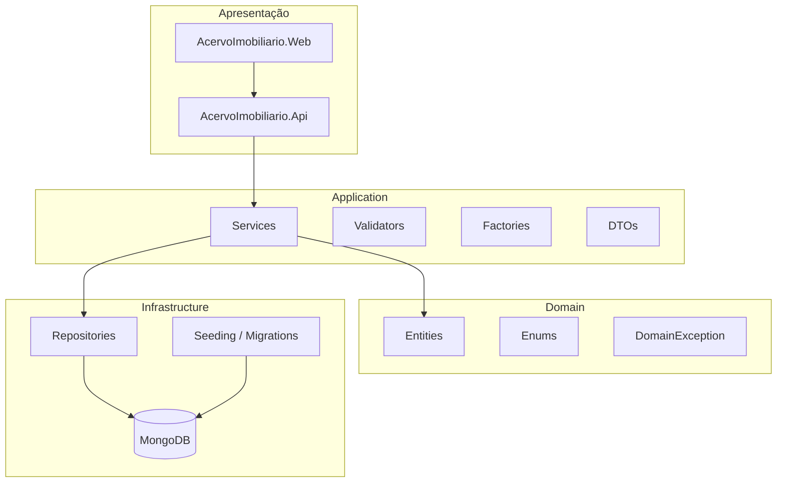
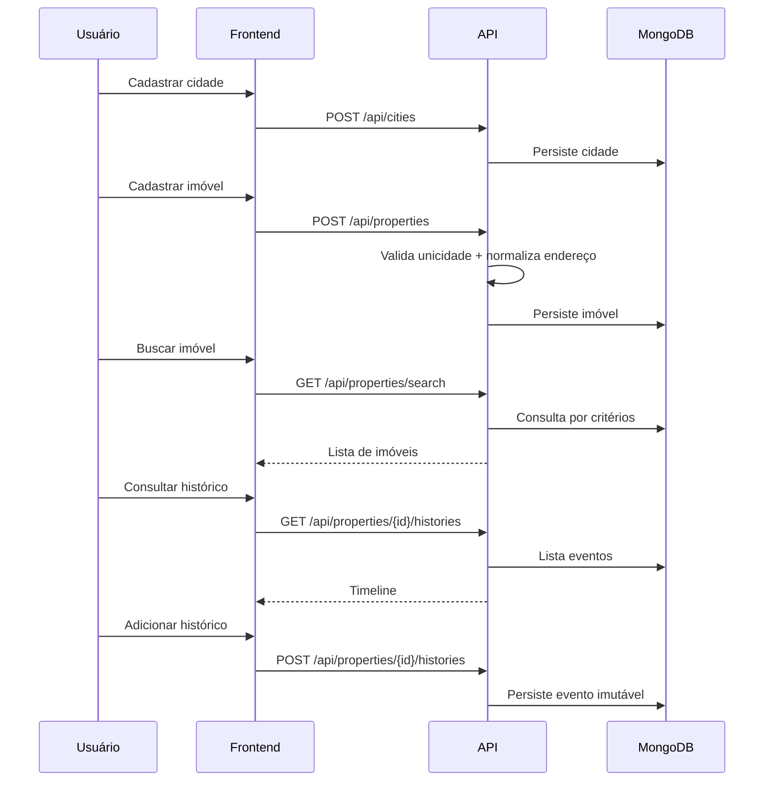

# Acervo Imobiliário

Sistema corporativo para **cadastro de imóveis por endereço único** e **manutenção de histórico imutável de eventos** associados a cada imóvel.

O objetivo é consolidar um acervo confiável de endereços e registrar a linha do tempo de ocorrências (vendas, visitas, manutenções, correções etc.), com foco em **consulta histórica** — não em gestão comercial de venda ou aluguel.

---

## Visão Geral

Imóveis costumam ser registrados de formas inconsistentes: variações de complemento, grafias diferentes e cadastros duplicados dificultam a rastreabilidade ao longo do tempo.

O Acervo Imobiliário resolve isso ao:

- **Identificar cada imóvel por endereço único**, composto por cidade, bairro, logradouro, número e complemento normalizado.
- **Impedir duplicidades** via validação de negócio e índice único no MongoDB.
- **Manter histórico imutável**: eventos podem ser criados, mas não editados nem excluídos (correções são registradas como novos eventos do tipo `Correction`).
- **Priorizar consulta e auditoria histórica**, em vez de fluxos de CRM ou pipeline de vendas.

---

## Funcionalidades

### Backend (API)

| Módulo | Funcionalidade |
|--------|----------------|
| **Cidades** | CRUD de cidades, listagem com filtros, busca por termo, ativação e inativação lógica |
| **Imóveis** | Cadastro, atualização, consulta por ID, busca por endereço ou índice cadastral |
| **Autocomplete** | Sugestões de bairro, rua e número para busca progressiva |
| **Histórico** | Criação e listagem de eventos por imóvel, com ordenação ascendente/descendente |
| **Inicialização** | Seed de cidades iniciais, criação de índices MongoDB e backfill de complementos normalizados |

### Frontend (Web)

| Tela | Funcionalidade |
|------|----------------|
| **Buscar imóveis** | Busca progressiva por endereço ou por índice cadastral, com autocomplete |
| **Cadastrar imóvel** | Formulário com validação e integração à API |
| **Detalhes do imóvel** | Visualização do endereço completo e metadados |
| **Histórico do imóvel** | Timeline em cards expansíveis, ordenação configurável |
| **Adicionar histórico** | Registro de novo evento (sem edição/exclusão) |
| **Cidades** | Listagem, cadastro, edição, detalhes, ativar/inativar |
| **PWA** | Instalação como app (Android/iOS), prompt minimizável |

> **Nota:** a API expõe `PUT /api/properties/{id}` para atualização de imóvel, porém **não há tela de edição de imóvel** no frontend nesta versão.

---

## Arquitetura

O projeto segue **Clean Architecture** com separação clara de responsabilidades e dependências apontando para o domínio.



### Camadas

| Camada | Projeto | Responsabilidade |
|--------|---------|------------------|
| **Domain** | `AcervoImobiliario.Domain` | Entidades ricas, enums, exceções de domínio e regras invariantes |
| **Application** | `AcervoImobiliario.Application` | Casos de uso (services), validadores, factories, mapeamentos e contratos de repositório |
| **Infrastructure** | `AcervoImobiliario.Infrastructure` | Persistência MongoDB, repositórios, seed, migrações e índices |
| **API** | `AcervoImobiliario.Api` | Controllers REST, middleware de exceções, Swagger e CORS |
| **Web** | `AcervoImobiliario.Web` | Interface React consumindo a API |

### Padrões adotados

| Padrão | Como é aplicado neste projeto |
|--------|-------------------------------|
| **DDD** | Entidades (`City`, `Property`, `PropertyHistory`) encapsulam regras e validações de criação/atualização |
| **SOLID** | Inversão de dependência via interfaces (`ICityService`, `IPropertyRepository` etc.) e injeção no DI |
| **Clean Architecture** | Domínio independente de frameworks; Application define contratos; Infrastructure implementa detalhes |
| **Result Pattern** | Retornos tipados (`Result<T>`) com distinção entre sucesso, validação, conflito e não encontrado |
| **Separação leitura/escrita** | Queries (`SearchPropertiesQuery`, `ListCitiesQuery`) e commands (`CreatePropertyRequest`) como DTOs dedicados, orquestrados por **Application Services** |

> **Importante:** esta versão **não utiliza MediatR nem FluentValidation**. A orquestração é feita por services na camada Application, com validadores estáticos próprios.

---

## Estrutura do Projeto

```
AcervoImobiliario/
├── AcervoImobiliario.sln
├── docker-compose.yml
│
├── AcervoImobiliario.Api/
│   ├── Controllers/
│   ├── Extensions/
│   ├── Middleware/
│   ├── Properties/
│   ├── appsettings.json
│   └── Program.cs
│
├── AcervoImobiliario.Application/
│   ├── Common/
│   ├── DTOs/
│   │   ├── Cities/
│   │   ├── Properties/
│   │   └── PropertyHistories/
│   ├── Enums/
│   ├── Factories/
│   ├── Interfaces/
│   ├── Mappings/
│   ├── Services/
│   └── Validators/
│
├── AcervoImobiliario.Domain/
│   ├── Entities/
│   ├── Enums/
│   └── Exceptions/
│
├── AcervoImobiliario.Infrastructure/
│   ├── Configuration/
│   ├── Migrations/
│   ├── Persistence/
│   │   ├── Documents/
│   │   └── Mappers/
│   ├── Repositories/
│   └── Seeding/
│
├── AcervoImobiliario.Domain.UnitTests/
├── AcervoImobiliario.Application.UnitTests/
│
└── AcervoImobiliario.Web/
    ├── public/
    ├── scripts/
    └── src/
        ├── api/
        ├── components/
        │   ├── city/
        │   ├── common/
        │   ├── history/
        │   ├── layout/
        │   ├── property/
        │   ├── pwa/
        │   └── ui/
        ├── hooks/
        ├── pages/
        ├── routes/
        ├── schemas/
        ├── services/
        ├── theme/
        ├── types/
        └── utils/
```

---

## Tecnologias Utilizadas

### Backend

| Tecnologia | Versão / Observação |
|------------|---------------------|
| .NET | 9.0 |
| ASP.NET Core | Web API |
| MongoDB | Driver oficial `MongoDB.Driver` 3.9.0 |
| Swagger | `Swashbuckle.AspNetCore` 7.2.0 |

### Frontend

| Tecnologia | Versão / Observação |
|------------|---------------------|
| React | 19 |
| TypeScript | 5.7 |
| Vite | 6 |
| Material UI (MUI) | 6 |
| TanStack React Query | 5 |
| React Router | 7 |
| React Hook Form | 7 |
| Zod | 3 |
| Axios | 1.8 |
| vite-plugin-pwa | 0.21 |

### Testes

| Tecnologia | Uso |
|------------|-----|
| xUnit | Framework de testes |
| FluentAssertions | Assertions expressivas |
| NSubstitute | Mocks e stubs |

---

## Modelo de Domínio

### Cidade (`City`)

| Campo | Tipo | Descrição |
|-------|------|-----------|
| `Id` | `string` | Identificador único |
| `Name` | `string` | Nome da cidade |
| `NameNormalized` | `string` | Nome normalizado (sem acentos, minúsculas) para busca e unicidade |
| `State` | `string` | UF (2 letras, maiúsculas) |
| `IsActive` | `bool` | Indica se a cidade está disponível para novos cadastros |
| `CreatedAt` | `DateTime` | Data de criação (UTC) |
| `UpdatedAt` | `DateTime?` | Data da última alteração |

**Unicidade:** combinação `NameNormalized` + `State` (índice único no MongoDB).

**Cidades iniciais (seed):** Belo Horizonte/MG, Contagem/MG, Betim/MG.

---

### Imóvel (`Property`)

| Campo | Tipo | Descrição |
|-------|------|-----------|
| `Id` | `string` | Identificador único |
| `CityId` | `string` | Referência à cidade |
| `CityNameSnapshot` | `string` | Nome da cidade no momento do cadastro |
| `Neighborhood` | `string` | Bairro |
| `NeighborhoodNormalized` | `string` | Bairro normalizado (`TextNormalizer`) |
| `Street` | `string` | Logradouro |
| `StreetNormalized` | `string` | Logradouro normalizado |
| `Number` | `string` | Número (somente dígitos) |
| `Complement` | `string?` | Complemento em texto livre |
| `ComplementNormalized` | `string` | Complemento normalizado para unicidade |
| `CadastralIndex` | `string?` | Índice cadastral opcional |
| `IsActive` | `bool` | Status do imóvel |
| `CreatedAt` | `DateTime` | Data de criação |
| `UpdatedAt` | `DateTime?` | Data da última alteração |

#### Regra de unicidade

Um imóvel é único pela chave composta:

```
CityId + NeighborhoodNormalized + StreetNormalized + Number + ComplementNormalized
```

- Imóveis **sem complemento** usam `ComplementNormalized` vazio.
- A validação ocorre na camada Application **e** é reforçada por índice único MongoDB (`ux_property_unique_address`).
- Cadastro em cidade **inativa** é rejeitado.

---

### Histórico (`PropertyHistory`)

| Campo | Tipo | Descrição |
|-------|------|-----------|
| `Id` | `string` | Identificador único |
| `PropertyId` | `string` | Imóvel associado |
| `EventType` | `PropertyHistoryEventType` | Tipo do evento |
| `EventDate` | `DateTime` | Data em que o evento ocorreu |
| `Description` | `string` | Descrição detalhada |
| `CreatedAt` | `DateTime` | Data de registro no sistema |

#### Tipos de evento

| Valor | Enum | Descrição |
|-------|------|-----------|
| 1 | `Sale` | Venda |
| 2 | `Rental` | Locação |
| 3 | `Visit` | Visita |
| 4 | `Proposal` | Proposta |
| 5 | `Contract` | Contrato |
| 6 | `Maintenance` | Manutenção |
| 7 | `Note` | Anotação |
| 8 | `RegistrationUpdate` | Atualização cadastral |
| 9 | `Correction` | Correção de registro anterior |
| 99 | `Other` | Outro |

#### Regra de imutabilidade

- Históricos são **somente criação e leitura**.
- Não há endpoints de atualização ou exclusão.
- Em caso de erro, registra-se um novo evento do tipo `Correction`.

---

## Normalização de Endereço

O sistema aplica duas estratégias de normalização:

### Bairro e logradouro (`TextNormalizer`)

- Remove acentos
- Converte para minúsculas
- Colapsa espaços duplicados

### Complemento (`AddressNormalizationService`)

Pipeline aplicado ao complemento:

1. Trim e remoção de acentos
2. Conversão para maiúsculas
3. Normalização de separadores (`.`, `-`, `/`, `_`, `,`, `;`)
4. Substituição de termos equivalentes por abreviações padronizadas

| Entrada original | Saída normalizada |
|------------------|-------------------|
| `Apartamento 303 Bloco A` | `APT 303 BLOCO A` |
| `Apto 303 Bloco A` | `APT 303 BLOCO A` |
| `APT 303 BLOCO A` | `APT 303 BLOCO A` |
| ` apto   303   bloco a ` | `APT 303 BLOCO A` |

Abreviações suportadas incluem: `APARTAMENTO`/`APTO` → `APT`, além de `LOJA`, `SALA`, `CASA`, `LOTE`, `QUADRA`, `FUNDOS`, `COBERTURA` e `BLOCO`.

A validação de unicidade e a busca por complemento utilizam **`ComplementNormalized`**, garantindo que variações equivalentes não gerem cadastros duplicados.

---

## Configuração Local

### Pré-requisitos

| Ferramenta | Versão mínima |
|------------|---------------|
| [.NET SDK](https://dotnet.microsoft.com/download) | 9.0 |
| [Node.js](https://nodejs.org/) | 20+ |
| [Docker](https://www.docker.com/) | Para MongoDB local (opcional se usar Atlas) |
| [Git](https://git-scm.com/) | Qualquer versão recente |

### 1. Clonar o repositório

```bash
git clone <url-do-repositorio>
cd AcervoImobiliario
```

### 2. MongoDB

**Opção A — Docker (recomendado para desenvolvimento local):**

```bash
docker compose up -d
```

Isso sobe o MongoDB 7 na porta `27017` com banco inicial `AcervoImobiliario`.

**Opção B — MongoDB Atlas:**

Configure a connection string em `AcervoImobiliario.Api/appsettings.Development.json` na seção `MongoDb:ConnectionString`.

### 3. Backend

```bash
dotnet restore
dotnet build
dotnet run --project AcervoImobiliario.Api
```

| Ambiente | URL |
|----------|-----|
| HTTP | http://localhost:5219 |
| HTTPS | https://localhost:7257 |
| Swagger (Development) | https://localhost:7257/swagger |

Na inicialização, a API executa automaticamente:

- Backfill de `ComplementNormalized` em imóveis existentes
- Criação de índices MongoDB
- Seed das cidades iniciais

### 4. Frontend

```bash
cd AcervoImobiliario.Web
npm install
cp .env.example .env
npm run dev
```

Acesse: **http://localhost:5173**

Em desenvolvimento, o Vite faz **proxy** de `/api` para `http://localhost:5219` (ver `vite.config.ts`). Nesse caso, `VITE_API_BASE_URL` pode ficar vazio.

### 5. Testes

```bash
dotnet test
```

Projetos de teste:

- `AcervoImobiliario.Domain.UnitTests`
- `AcervoImobiliario.Application.UnitTests`

### 6. Build de produção (frontend)

```bash
cd AcervoImobiliario.Web
npm run build
npm run preview
```

---

## Variáveis de Ambiente

### Backend (.NET)

| Variável / Configuração | Onde definir | Finalidade |
|-------------------------|--------------|------------|
| `ASPNETCORE_ENVIRONMENT` | `launchSettings.json` ou ambiente | Define ambiente (`Development`, `Production`) |
| `MongoDb:ConnectionString` | `appsettings.json` / `appsettings.Development.json` / env `MongoDb__ConnectionString` | String de conexão MongoDB |
| `MongoDb:DatabaseName` | `appsettings.json` / env `MongoDb__DatabaseName` | Nome do banco (padrão: `AcervoImobiliario`) |
| `MongoDb:CitiesCollectionName` | `appsettings.json` | Coleção de cidades (padrão: `cities`) |
| `MongoDb:PropertiesCollectionName` | `appsettings.json` | Coleção de imóveis (padrão: `properties`) |
| `MongoDb:PropertyHistoriesCollectionName` | `appsettings.json` | Coleção de históricos (padrão: `property_histories`) |

> Em produção (.NET), use a convenção de variáveis com `__` para chaves aninhadas, por exemplo: `MongoDb__ConnectionString`.

### Frontend (Vite)

| Variável | Arquivo | Finalidade |
|----------|---------|------------|
| `VITE_API_BASE_URL` | `.env` / `.env.example` | URL base da API. Vazio em dev (usa proxy Vite). Obrigatório em build de produção. |

### Docker Compose

| Variável | Finalidade |
|----------|------------|
| `MONGO_INITDB_DATABASE` | Banco criado na primeira inicialização do container (`AcervoImobiliario`) |

---

## Endpoints

Base URL local: `http://localhost:5219`

Documentação interativa disponível em **Swagger** no ambiente `Development`.

### Cities — `/api/cities`

| Método | Rota | Objetivo |
|--------|------|----------|
| `GET` | `/api/cities` | Lista cidades com filtros opcionais (`name`, `status`) |
| `GET` | `/api/cities/search?term=` | Busca cidades por termo |
| `GET` | `/api/cities/{id}` | Obtém cidade por ID |
| `POST` | `/api/cities` | Cria nova cidade |
| `PUT` | `/api/cities/{id}` | Atualiza cidade existente |
| `POST` | `/api/cities/{id}/activate` | Ativa cidade |
| `POST` | `/api/cities/{id}/deactivate` | Inativa cidade |

**Filtro de status (`status`):** `Active` (padrão), `Inactive`, `All`.

---

### Properties — `/api/properties`

| Método | Rota | Objetivo |
|--------|------|----------|
| `GET` | `/api/properties/search` | Busca imóveis por endereço ou índice cadastral |
| `GET` | `/api/properties/{id}` | Obtém imóvel por ID |
| `POST` | `/api/properties` | Cadastra novo imóvel |
| `PUT` | `/api/properties/{id}` | Atualiza imóvel existente |

**Parâmetros de busca (`/search`):**

| Parâmetro | Descrição |
|-----------|-----------|
| `cityId` | ID da cidade |
| `neighborhood` | Bairro |
| `street` | Logradouro |
| `number` | Número |
| `complement` | Complemento (normalizado na busca) |
| `cadastralIndex` | Índice cadastral |
| `includeInactive` | Incluir imóveis inativos (`false` por padrão) |

---

### Autocomplete — `/api/properties`

| Método | Rota | Objetivo |
|--------|------|----------|
| `GET` | `/api/properties/neighborhoods/search` | Autocomplete de bairros (`cityId`, `term`) |
| `GET` | `/api/properties/streets/search` | Autocomplete de ruas (`cityId`, `neighborhood`, `term`) |
| `GET` | `/api/properties/numbers/search` | Autocomplete de números (`cityId`, `neighborhood`, `street`, `term`) |

---

### Property Histories — `/api/properties/{propertyId}/histories`

| Método | Rota | Objetivo |
|--------|------|----------|
| `GET` | `/api/properties/{propertyId}/histories` | Lista histórico do imóvel (`sortDirection`: `asc` ou `desc`) |
| `POST` | `/api/properties/{propertyId}/histories` | Registra novo evento no histórico |

---

## Fluxo Principal



1. **Cadastrar cidade** — necessário antes de registrar imóveis na localidade.
2. **Cadastrar imóvel** — informar endereço completo; o sistema valida duplicidade.
3. **Buscar imóvel** — busca progressiva por endereço ou direta por índice cadastral.
4. **Consultar histórico** — visualizar linha do tempo de eventos do imóvel.
5. **Adicionar histórico** — registrar novo evento (imutável após salvo).

---

## Publicação

> Esta seção descreve o deploy preparado com base na configuração atual do projeto. **Não há arquivos `railway.toml` ou pipelines CI/CD** versionados neste repositório.

### Backend (API)

| Item | Configuração |
|------|--------------|
| **Runtime** | .NET 9 |
| **Comando de start** | `dotnet AcervoImobiliario.Api.dll` |
| **Porta** | Definida pela plataforma via `ASPNETCORE_URLS` ou variável `PORT` |
| **Banco** | MongoDB (Atlas recomendado em produção) |
| **Variáveis obrigatórias** | `MongoDb__ConnectionString`, `ASPNETCORE_ENVIRONMENT=Production` |
| **CORS** | Atualmente liberado para `localhost:5173` — **ajustar origens** para o domínio do frontend em produção (`Program.cs`) |

### Frontend (Web)

| Item | Configuração |
|------|--------------|
| **Build** | `npm run build` (gera `dist/`) |
| **Variável obrigatória** | `VITE_API_BASE_URL=<url-da-api-em-producao>` |
| **Tipo de deploy** | Site estático (Vite) ou PWA |
| **Preview local** | `npm run preview` |

### MongoDB

| Item | Configuração |
|------|--------------|
| **Local** | `docker compose up -d` |
| **Produção** | MongoDB Atlas ou serviço gerenciado compatível |
| **Índices** | Criados automaticamente na inicialização da API |

### Railway (orientação)

1. Criar serviço **MongoDB** (plugin Atlas ou connection string externa).
2. Criar serviço **API** apontando para `AcervoImobiliario.Api`, configurando `MongoDb__ConnectionString`.
3. Criar serviço **Web** com build `npm run build` e publicação da pasta `dist/`, definindo `VITE_API_BASE_URL` com a URL pública da API.
4. Atualizar política CORS na API com a URL do frontend publicado.

---

## Boas Práticas Adotadas

| Prática | Aplicação no projeto |
|---------|----------------------|
| **SOLID** | Interfaces por responsabilidade, injeção de dependência, entidades com comportamento coeso |
| **Clean Architecture** | Camadas independentes, domínio livre de MongoDB e ASP.NET |
| **DDD** | Modelagem orientada ao domínio imobiliário, exceções de negócio (`DomainException`) |
| **Validação em camadas** | Validadores na Application + invariantes nas entidades de domínio |
| **Testes unitários** | Cobertura de entidades, services, factories, normalização e regras de sistema |
| **Imutabilidade de histórico** | Apenas `Create` e `List` no repositório de histórico |
| **Índices de banco** | Unicidade garantida no MongoDB além da validação applicativa |

---

## Roadmap

Melhorias futuras planejadas (não implementadas nesta versão):

- [ ] **Controle de usuários e autenticação** (login, perfis, autorização)
- [ ] **Auditoria** de alterações em imóveis e cidades
- [ ] **Dashboard** com indicadores do acervo
- [ ] **Relatórios** exportáveis (PDF/Excel)
- [ ] **Tela de edição de imóvel** no frontend (API já disponível)
- [ ] **CI/CD** automatizado (build, testes e deploy)
- [ ] **Cache offline** da API no PWA

---

## Licença

Este projeto **ainda não possui arquivo de licença** (`LICENSE`) na raiz do repositório.

Defina a licença adequada (por exemplo, MIT, Apache 2.0 ou proprietária) antes de distribuição pública.

---

## Documentação complementar

- Frontend: [`AcervoImobiliario.Web/README.md`](AcervoImobiliario.Web/README.md)
